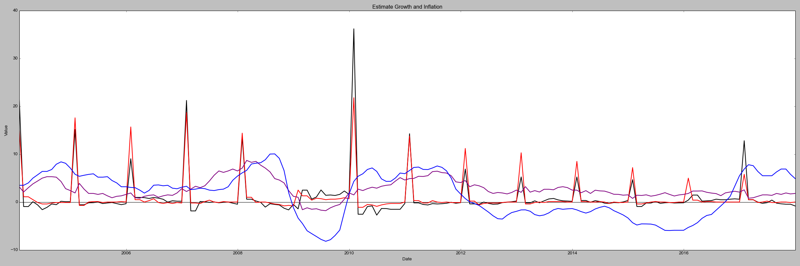
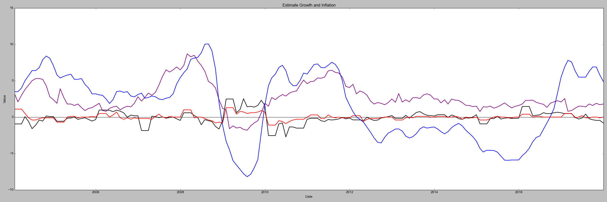
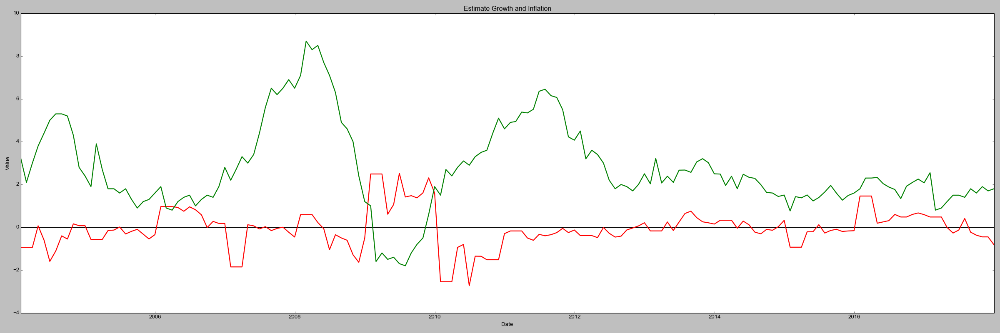
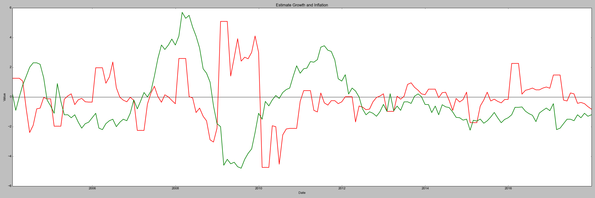
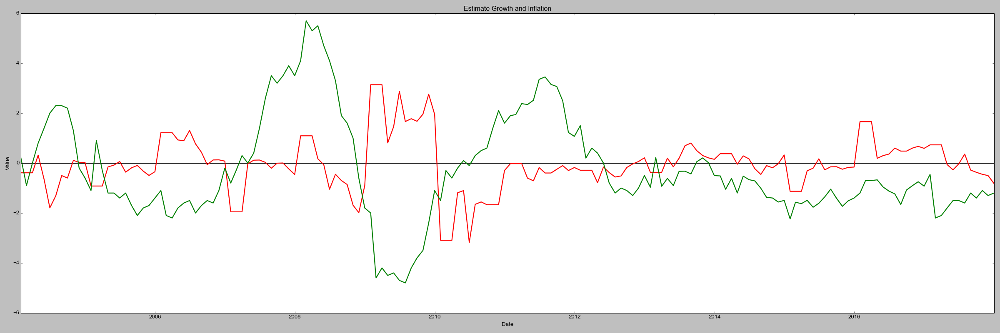
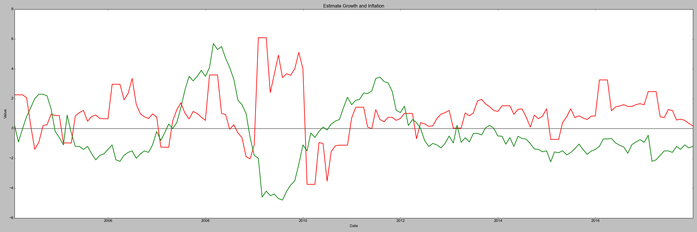
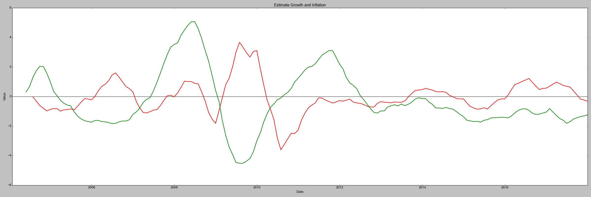

## 判断经济周期类别

#### 基本思路

根据题目所给的经济周期表格，要判断指定月份的经济周期类别，只需判断当月的经济增长和通货膨胀水平的正负
已知

    经济增长与KQI，IP相关
    通货膨胀水平与CPI，PPI相关
假设以上两条都是线性关系，设：
Growth = k1\*(KQI_Grow + a\*IP_Grow + b)
Inflation = k2\*(CPI + c\*PPI +d)

对于每一条数据，都能通过4个给定值来判断其所处周期类别
由于只需要确定Growth与Inflation的正负，可以省去k1与k2
现在只需要调整a，b，c，d来优化结果
由于没有给定结果标签，不能通过监督学习调整4个参数的值，我打算通过matplot作出相应的图，判断答案是否合理，之后再手动调整参数

#### 数据预处理

预处理需要处理的内容主要有KQI列与IP列，因为这两列数据有空缺。因为这两列的值代表了每个月相对年初的变化，所以在取KQI_Grow与IP_Grow时，需要注意把每一年的数据放在一起比较，不能跨年比较。
经过对数据集的简单观察后，对这两列的处理流程如下：
- 对每一年单独进行处理
- 遍历该年的数据，遇到空缺行时
  - 如果空缺行为这一年的第一个月，取之后两个月的值m1,m2，填充为2\*m1 - m2
  - 如果空缺行不为这一年的第一个月，取之前两个月的值m1,m2，填充为2\*m2 - m1
- 填充完成后，进行每月的差值运算，对每一年进行单独处理
  - 如果是第一个月，KQI_Grow(i)等于KQI(i)
  - 如果不是地一个月，KQI_Grow(i)等于KQI(i)-KQI(i-1)
除此之外，还需要将Date行转化为Date类型，用于做图

#### 数据分布分析

按照上述步骤进行数据预处理后，先做图画出数据分布图：

    黑色： KQI_Grow
    红色： IP_grow
    紫色： CPI
    蓝色： PPI

几乎在每年年初，KQI和IP的变化值都特别大，因此在这里再进行一次处理，替换每年年初的KQI_Grow与IP_Grow值，让曲线更平滑，替换方式与上文相同，调整之后的数据分布图如下

#### 参数调整

默认情况下，设置a,b,c,d为1-0-1-0，对于每个与Growth与Inflation的估计如下

    红色： Growth
    绿色： Inflation

可见Inflation基本满足题目所说周期变化，只需将其曲线下移一下就能得到比较好的效果;而Growth的曲线不理想，虽然分布在0轴附近，但起伏较大，观察参数分布图中的值发现，KQI_Grow与IP_Grow的变化趋势基本相同，因此只通过简单的线性变化可能得不到好的结果。

在此保持c的值不变，将d设为-3，再调整a与b的值

    a: 2
    b: 0

    a: 0.5
    b: 0

    a: 2
    b：1

经过多次调整，决定a取2,b取0，为了消除噪声，为每个点设置一个窗口，该点的值等于窗口内的平均值，对于Growth来说，围绕0轴的波动较多，所以窗口值设置得大一些;对于Inflation来说，噪点较少，为防止边缘严重模糊，窗口值可以小一些
经过测试，Growth窗口取7,Inflation窗口取5时，效果比较好，分布图如下

#### 输出结果

结果将输出到csv文件中，文件名Result.csv
结果不太理想，状态转换顺序和文中所写区别比较大

#### 结论
在本次项目中，建模使用了最简单的线性关系，结果不太理想，而且做不到对未来的预测。
优化方式有：
- 使用更复杂的模型
- 人工添加标签后，进行机器学习，自动调整参数大小
